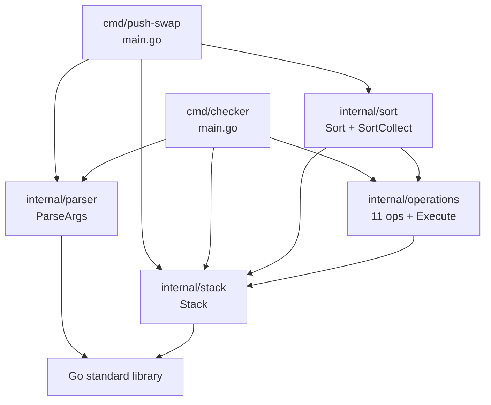
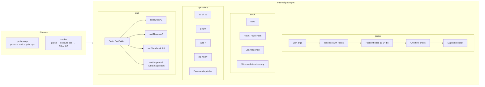
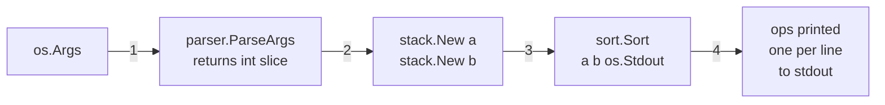
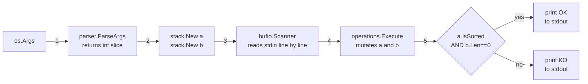
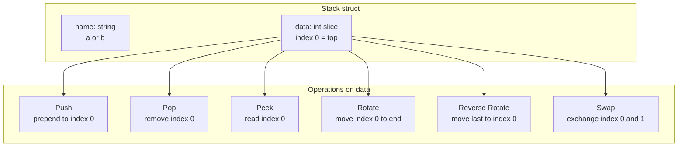

# Push-Swap Architecture

## Package dependency graph

```mermaid
flowchart TD
    PS[cmd/push-swap\nmain.go]
    CH[cmd/checker\nmain.go]
    PA[internal/parser\nParseArgs]
    ST[internal/stack\nStack]
    OP[internal/operations\n11 ops + Execute]
    SO[internal/sort\nSort + SortCollect]
    LIB[Go standard library]

    PS --> PA
    PS --> ST
    PS --> SO
    CH --> PA
    CH --> ST
    CH --> OP
    SO --> ST
    SO --> OP
    OP --> ST
    PA --> LIB
    ST --> LIB
```

---

## Package responsibilities

```mermaid
flowchart LR
    subgraph cmd[Binaries]
        PS[push-swap\nparse → sort → print ops]
        CH[checker\nparse → execute ops → OK or KO]
    end

    subgraph internal[Internal packages]
        subgraph PA[parser]
            PA1[Join args]
            PA2[Tokenise with Fields]
            PA3[ParseInt base 10 64-bit]
            PA4[Overflow check]
            PA5[Duplicate check]
            PA1 --> PA2 --> PA3 --> PA4 --> PA5
        end

        subgraph ST[stack]
            ST1[New]
            ST2[Push / Pop / Peek]
            ST3[Len / IsSorted]
            ST4[Slice — defensive copy]
        end

        subgraph OP[operations]
            OP1[sa sb ss]
            OP2[pa pb]
            OP3[ra rb rr]
            OP4[rra rrb rrr]
            OP5[Execute dispatcher]
        end

        subgraph SO[sort]
            SO1[Sort / SortCollect]
            SO2[sortTwo n=2]
            SO3[sortThree n=3]
            SO4[sortSmall n=4,5,6]
            SO5[sortLarge n>6\nTurkish algorithm]
            SO1 --> SO2
            SO1 --> SO3
            SO1 --> SO4
            SO1 --> SO5
        end
    end

    cmd --> internal
```

---

## Data flow — push-swap

```mermaid
flowchart LR
    A[os.Args] -->|1| B[parser.ParseArgs\nreturns int slice]
    B -->|2| C[stack.New a\nstack.New b]
    C -->|3| D[sort.Sort\na b os.Stdout]
    D -->|4| E[ops printed\none per line\nto stdout]
```

---

## Data flow — checker

```mermaid
flowchart LR
    A[os.Args] -->|1| B[parser.ParseArgs\nreturns int slice]
    B -->|2| C[stack.New a\nstack.New b]
    C -->|3| D[bufio.Scanner\nreads stdin line by line]
    D -->|4| E[operations.Execute\nmutates a and b]
    E -->|5| F{a.IsSorted\nAND b.Len==0}
    F -->|yes| G[print OK\nto stdout]
    F -->|no| H[print KO\nto stdout]
```

---

## Stack internals

```mermaid
flowchart TD
    subgraph Stack struct
        N[name: string\na or b]
        D[data: int slice\nindex 0 = top]
    end

    subgraph Operations on data
        PU[Push\nprepend to index 0]
        PO[Pop\nremove index 0]
        PE[Peek\nread index 0]
        RO[Rotate\nmove index 0 to end]
        RR[Reverse Rotate\nmove last to index 0]
        SW[Swap\nexchange index 0 and 1]
    end

    D --> PU
    D --> PO
    D --> PE
    D --> RO
    D --> RR
    D --> SW
```
