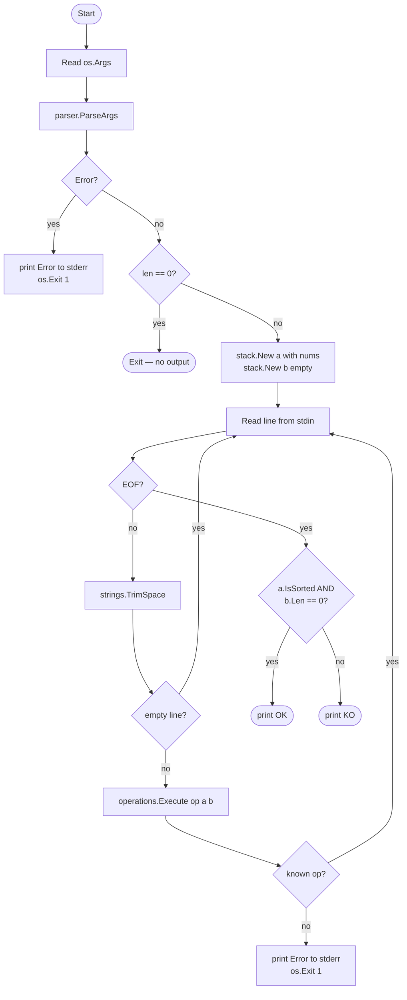
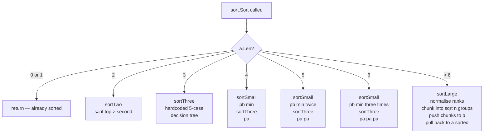

# Push-Swap Flowcharts

## push-swap binary flow

```mermaid
flowchart TD
    A([Start]) --> B[Read os.Args]
    B --> C[parser.ParseArgs]
    C --> D{Error?}
    D -->|yes| E[print Error to stderr\nos.Exit 1]
    D -->|no| F{len == 0?}
    F -->|yes| G([Exit — no output])
    F -->|no| H[stack.New a with nums\nstack.New b empty]
    H --> I[sort.Sort a b stdout]
    I --> J{n?}
    J -->|0 or 1| K[0 ops]
    J -->|2| L[sortTwo\nmax 1 op]
    J -->|3| M[sortThree\nmax 2 ops]
    J -->|4 5 6| N[sortSmall\nmax 11 ops]
    J -->|> 6| O[sortLarge\nTurkish algorithm\nmax 699 ops]
    K --> P([Print ops to stdout\nExit])
    L --> P
    M --> P
    N --> P
    O --> P
```

---

## checker binary flow

```mermaid
flowchart TD
    A([Start]) --> B[Read os.Args]
    B --> C[parser.ParseArgs]
    C --> D{Error?}
    D -->|yes| E[print Error to stderr\nos.Exit 1]
    D -->|no| F{len == 0?}
    F -->|yes| G([Exit — no output])
    F -->|no| H[stack.New a with nums\nstack.New b empty]
    H --> I[Read line from stdin]
    I --> J{EOF?}
    J -->|no| K[strings.TrimSpace]
    K --> L{empty line?}
    L -->|yes| I
    L -->|no| M[operations.Execute op a b]
    M --> N{known op?}
    N -->|no| O[print Error to stderr\nos.Exit 1]
    N -->|yes| I
    J -->|yes| P{a.IsSorted AND\nb.Len == 0?}
    P -->|yes| Q([print OK])
    P -->|no| R([print KO])
```

---

## sort algorithm decision tree

```mermaid
flowchart TD
    A[sort.Sort called] --> B{a.Len?}
    B -->|0 or 1| C[return — already sorted]
    B -->|2| D[sortTwo\nsa if top > second]
    B -->|3| E[sortThree\nhardcoded 5-case\ndecision tree]
    B -->|4| F[sortSmall\npb min\nsortThree\npa]
    B -->|5| G[sortSmall\npb min twice\nsortThree\npa pa]
    B -->|6| H[sortSmall\npb min three times\nsortThree\npa pa pa]
    B -->|> 6| I[sortLarge\nnormalise ranks\nchunk into sqrt n groups\npush chunks to b\npull back to a sorted]
```
