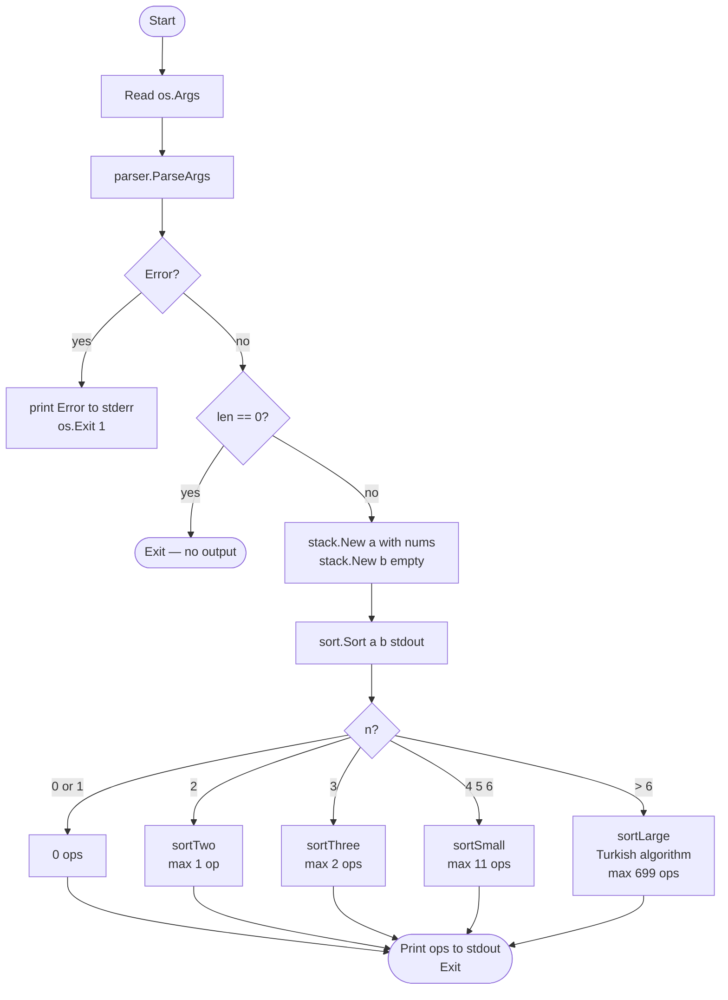
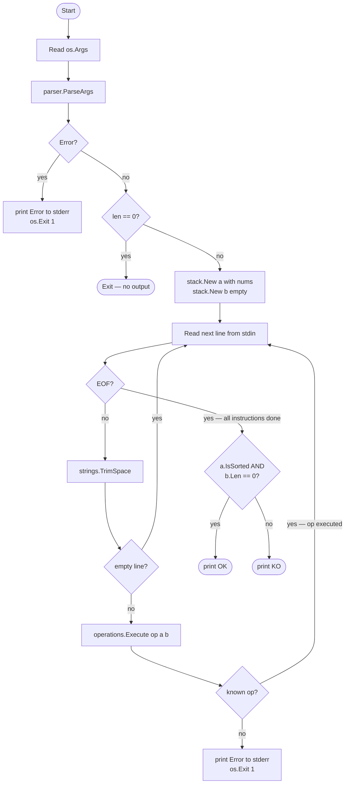

# Push-Swap Flowcharts

## push-swap binary flow

```mermaid
flowchart TD
    A([Start]) --> B[Read os.Args]
    B --> C[parser.ParseArgs]
    C --> D{Error?}
    D -->|yes| E[print Error to stderr
os.Exit 1]
    D -->|no| F{len == 0?}
    F -->|yes| G([Exit — no output])
    F -->|no| H[stack.New a with nums
stack.New b empty]
    H --> I[sort.Sort a b stdout]
    I --> J{n?}
    J -->|0 or 1| K[0 ops]
    J -->|2| L[sortTwo
max 1 op]
    J -->|3| M[sortThree
max 2 ops]
    J -->|4 5 6| N[sortSmall
max 11 ops]
    J -->|> 6| O[sortLarge
Turkish algorithm
max 699 ops]
    K --> P([Print ops to stdout
Exit])
    L --> P
    M --> P
    N --> P
    O --> P
```

---

## checker binary flow

```mermaid
flowchart TD
    A([Start]) --> B[Read os.Args]
    B --> C[parser.ParseArgs]
    C --> D{Error?}
    D -->|yes| E[print Error to stderr
os.Exit 1]
    D -->|no| F{len == 0?}
    F -->|yes| G([Exit — no output])
    F -->|no| H[stack.New a with nums
stack.New b empty]
    H --> I[Read next line from stdin]
    I --> J{EOF?}
    J -->|no| K[strings.TrimSpace]
    K --> L{empty line?}
    L -->|yes| I
    L -->|no| M[operations.Execute op a b]
    M --> N{known op?}
    N -->|no| O[print Error to stderr
os.Exit 1]
    N -->|yes — op executed| I
    J -->|yes — all instructions done| P{a.IsSorted AND
b.Len == 0?}
    P -->|yes| Q([print OK])
    P -->|no| R([print KO])
```
